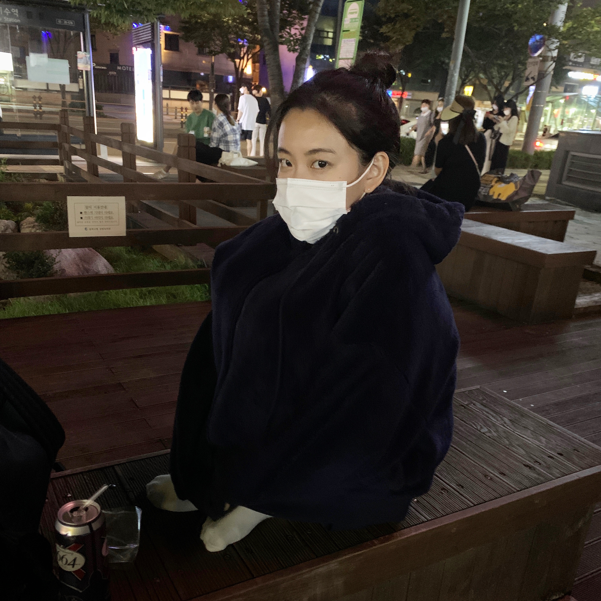

### Suebeen's TIL 🔥

[벨로그 블로그](https://velog.io/@clapkong)

꾸준하게 TIL 작성하기!!!!!

|날짜|제목|설명|링크|
|---|---|---|---|
|2021/08/02|[TIL] 데브코스 W1D1|JAVA이야기|[링크](https://velog.io/@clapkong/Java%EC%9D%B4%EC%95%BC%EA%B8%B0)|
|2021/08/03|[TIL] 데브코스 W1D2|객체지향 프로그래밍(OOP)|[링크](https://velog.io/@clapkong/%EA%B0%9D%EC%B2%B4%EC%A7%80%ED%96%A5-%ED%94%84%EB%A1%9C%EA%B7%B8%EB%9E%98%EB%B0%8DObject-Oriented-Programming)|
|2021/08/04|[TIL] 데브코스 W1D3|JAVA 인터페이스(Interface)|[링크](https://velog.io/@clapkong/JAVA-%EC%9D%B8%ED%84%B0%ED%8E%98%EC%9D%B4%EC%8A%A4Interface)|
|2021/08/05|[TIL] 데브코스 W1D4|JAVA 컬렉션(Collection)|[링크](https://velog.io/@clapkong/JAVA-%EC%BB%AC%EB%A0%89%EC%85%98Collection)|
|2021/08/06|[TIL] 데브코스 W1D5|실습 프로젝트(숫자 야구게임)|[링크](https://velog.io/@clapkong/%EC%8B%A4%EC%8A%B5-%ED%94%84%EB%A1%9C%EC%A0%9D%ED%8A%B8)|
||||
|2021/08/09|[TIL] 데브코스 W2D1|관계형 데이터베이스|[링크](https://velog.io/@clapkong/%EA%B4%80%EA%B3%84%ED%98%95-%EB%8D%B0%EC%9D%B4%ED%84%B0%EB%B2%A0%EC%9D%B4%EC%8A%A4)|
|2021/08/10|[TIL] 데브코스 W2D2|클라우드와 AWS|[링크]()|https://velog.io/@clapkong/%ED%81%B4%EB%9D%BC%EC%9A%B0%EB%93%9C%EC%99%80-AWS|
