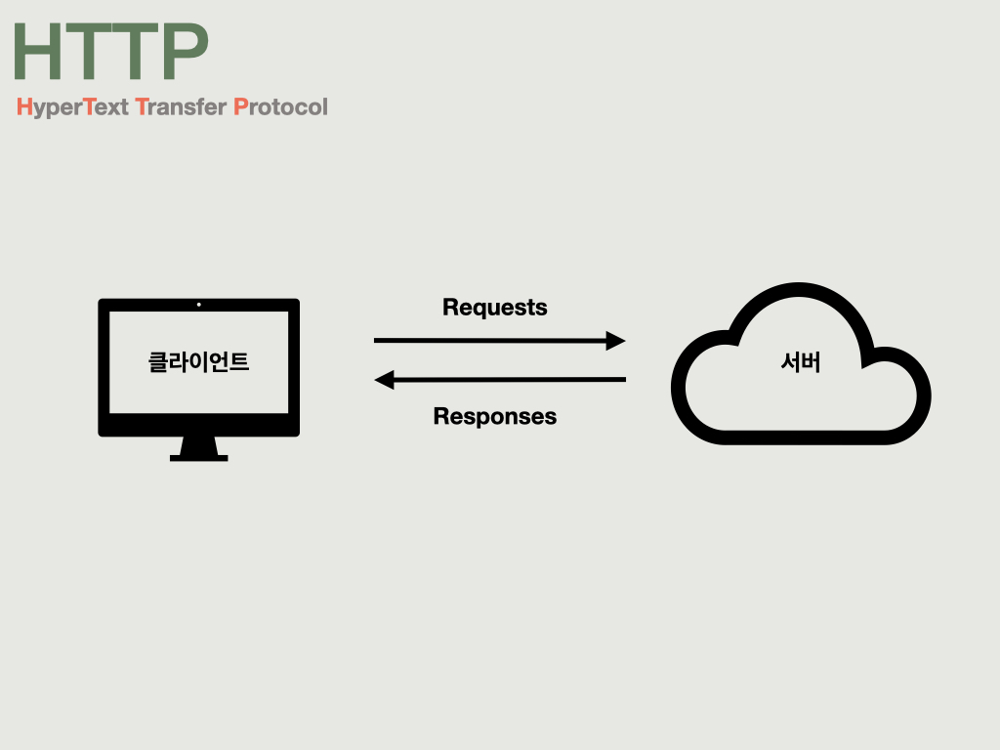
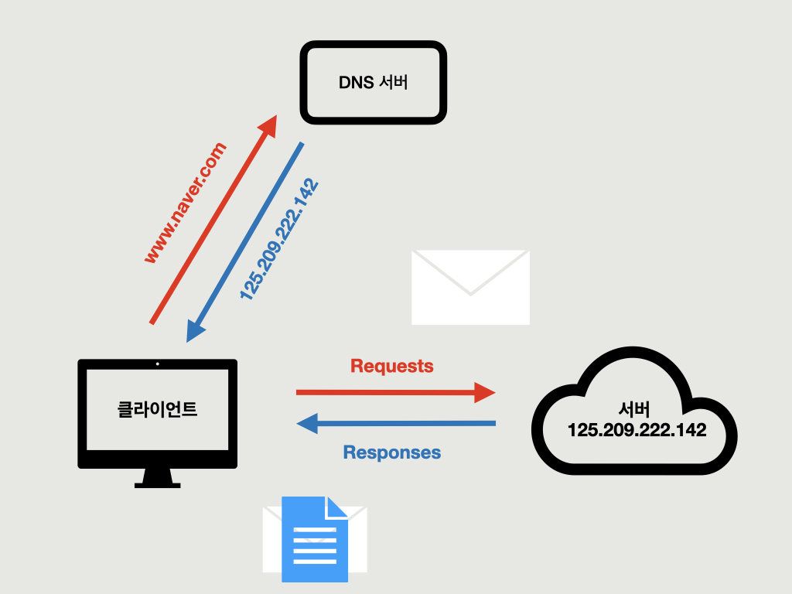
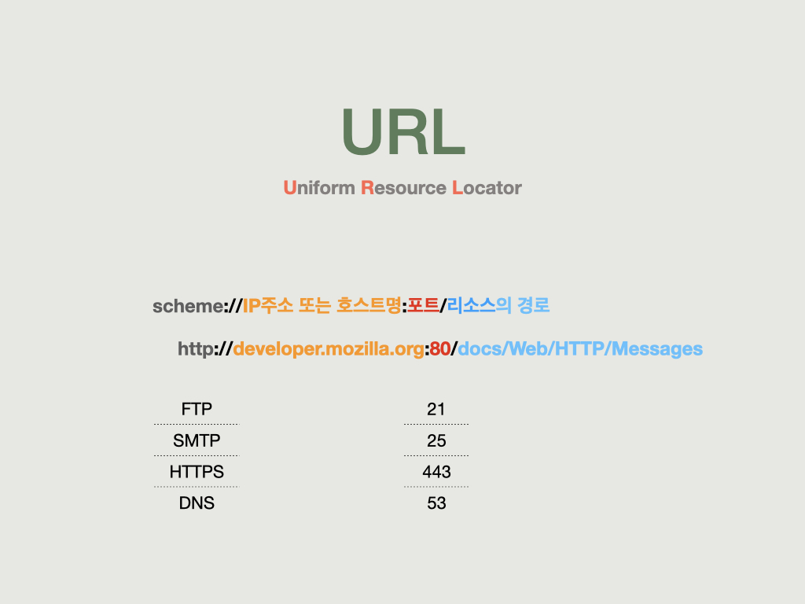
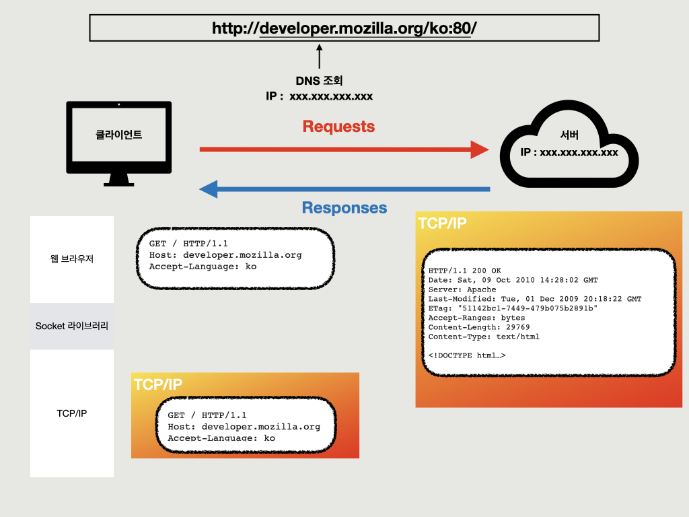
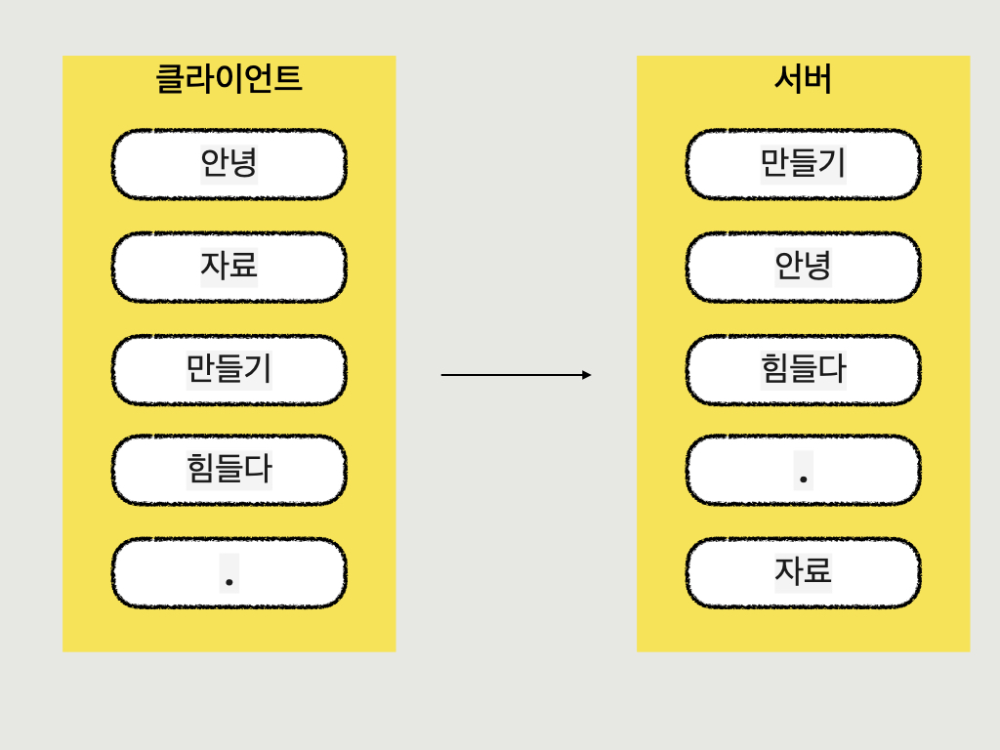
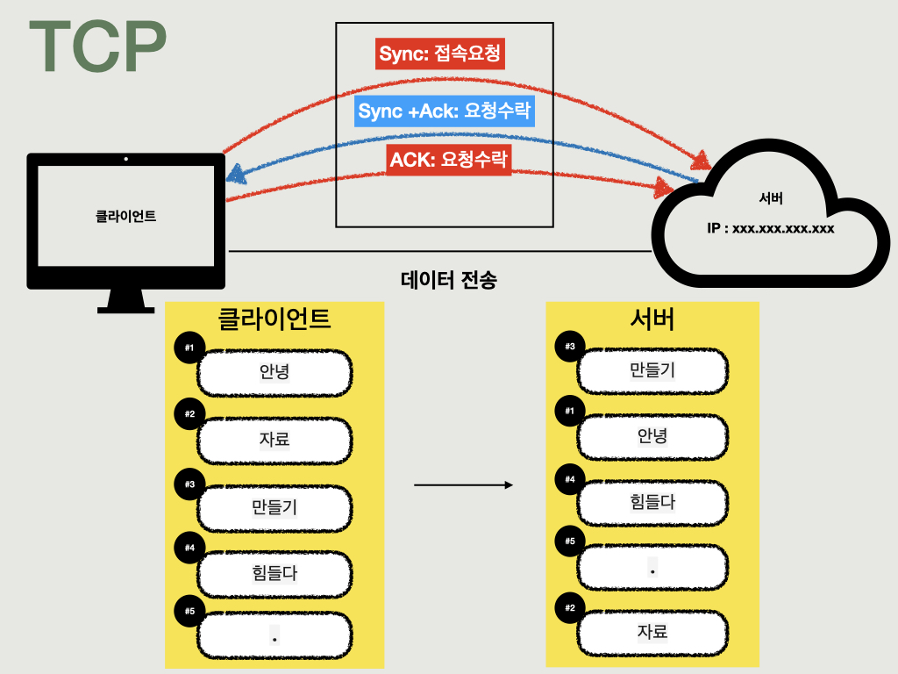
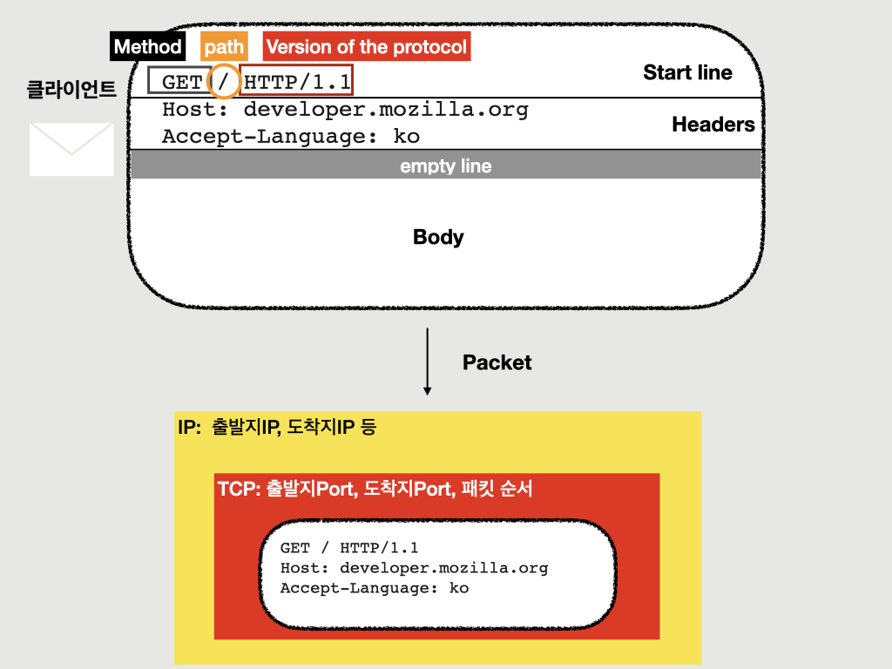
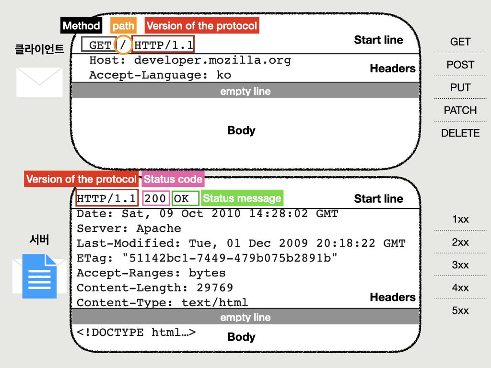

<code>Http</code>는 어떻게 클라이언트(웹 브라우저)와 서버(웹 서버)가 통신을 하는지 명확한 규칙을 제공합니다.
 

웹 브라우저를 열고 www.naver.com 을 입력했을 때, 컴퓨터는 DNS 서버에 접속합니다.  
DNS 서버는 도메인 이름에 대응하는 IP 주소를 받아서 네이버의 서버에 웹 페이지의 내용을 <code>요청</code>합니다. 
서버는 그 요청에 <code>응답</code>하기 위해 요청을 <code>해석</code>하고, 요청된 페이지를 클라이언트에게 돌려보냅니다. 
웹 브라우저는 본문에 써있는대로 화면에 그려줍니다(렌더링).
 

<code>URL</code>은 스키마, 호스트네임 또는 ip주소와 포트, 리소스 경로 등의 정보를 갖고있습니다. 
<u>Scheme</u>는 응용 프로그램과 서버가 통신하는 전송 프로토콜을 나타냅니다. 
*전송프로토콜: 어떤 방식으로 자원에 접근할 것인가 하는 약속 규칙* 

|ftp|파일 전송 프로토콜|
|:--:|:--:|
|smtp|이메일 전송 프로토콜|
|http|웹프로토콜|
|https|http에 보안을 추가한 프로토콜|

 
<u>포트</u>는 응용프로그램 등의 고유 식별코드입니다. 
*0 ~ 1023: 잘 알려진 포트, 사용하지 않는 것이 좋음*
 

<code>웹 브라우저</code>가 HTTP 메시지를 생성하고 
<code>소켓 라이브러리</code>를 통해 TCP/IP로 데이터 전달 
<code>TCP/IP</code>에서 패킷을 생성하고 출발지.도착지 IP,PORT를 담아서 
Lan 또는 AP를 통해 <code>라우터</code>를 거쳐 서버에 도착합니다. 
<code>서버</code>는 요청메시지를 해석하고 응답 메시지와 요청된 데이터를 클라이언트에 전송합니다
 

 

<code>IP 인터넷 프로토콜</code>는 인터넷에 연결되어 있는 모든 장치들(컴퓨터, 서버 장비, 스마트폰 등)을 식별할 수 있도록 각각의 장비에게 부여되는 고유 주소입니다. 
<code>라우터</code>는 한 컴퓨터에서 다른 컴퓨터로 정보를 보내는 것을 도와주는 장치입니다. 송신 장치에서 목적지까지 가기 위해 데이터는 보통 여러 라우터들을 거쳐가야 합니다. 
각 라우터는 최종 목적지까지 가기 위해 어느 방향으로 데이터를 보내야 하는지 알아낼 때 필요한 지시 정보들의 집합으로 만들어져 있습니다. 

IP의 한계점은 다음과 같습니다.
1. 비연결성: 서버가 꺼져있거나, 패킷을 받을 대상이 없거나 서비스 불능상태인 경우
2. 비신뢰성: 중간에 데이터가 소실되는 경우, 데이터가 순서에 맞지 않게 도착하는 경우 등 
3. 같은 IP를 사용하는데, 통신하는 애플리케이션이 둘 이상인 경우   
e.g. 게임하면서 인터넷 검색하면서 음악들을 때, 같은 IP주소이기 때문에 구분하기 어렵다.
 

<code>TCP(Transmission Control Protocol) 전송제어프로토콜</code>는 데이터 스트림을 교환하게 해주는 중요한 네트워크 프로토콜입니다. 
에러가 없이 패킷이 신뢰할 수 있게 전달 되었는지 보증해주기 때문에 IP의 한계점을 보완해줍니다. 

   1. 3-way handshake : 먼저 연결을 하고 확인이 되면 메시지를 전송하는 것 
      e.g. 준비됐니? // 응 준비됐어 + 너도 준비됐니? // 응 나도 준비됐어 + 데이터 전송 
   2. 데이터 전달 보증 및 순서 보장(패킷) : 한 컴퓨터가 다른 컴퓨터로 데이터를 보낼 때 커다란 하나의 패킷을 작은 패킷들로 나누어 보냄 
      TCP는 데이터를 순서 있는 패킷들로 분해, 각 패킷에 대해 순서에 맞게 번호를 매김 
      => 수신 컴퓨터는 받은 패킷들을 올바른 순서로 재조립할 수 있게 됨 
   3. PORT 할당: 같은 컴퓨터 내에서 여러 프로그램을 사용할 때, 이를 구분해주는 것. 
   예를 들어, SMTP(이메일)는 25번 포트를 사용하지만 HTTP(일반 웹 검색)는 80번 포트를 사용합니다.
 

<code>TCP/IP 요약</code> 
인터넷이 통신하기 위한 과정을 요약하면, 인터넷을 통해 데이터를 받기 위해서 우선 데이터가 더 작은 패킷들로 분해되어야 하고, 
TCP는 각 패킷에 포트 번호와 패킷 번호를 매깁니다. IP가 패킷의 목적지를 알려주면 라우터들을 통해 데이터가 전송됩니다. 
라우터들은 패킷을 목적지로 보내줄 것입니다.
 

요청메시지와 응답메시지의 폼은 크게 다르지 않습니다. 
메시지는 스타트라인, 헤더, 공백, 바디로 구성되어있습니다.  

클라이언트의 요청메시지를 보면 스타트라인은 메소드, 경로, 프로토콜 버전이 작성되어있습니다. 
메소드는 주로 Get, Post, Put, Patch, Delete를 사용하며 이것들 외에도 더 많은 메소드가 존재합니다. 
게시판 작성을 예로 들자면, Get은 페이지를 조회 할 때, Post는 글을 작성 할 때, Put과 Patch는 수정 할 때, Delete는 글을 삭제 할 때 사용한다고 생각하면 이해가 좀더 쉽습니다. 
Headers에는 호스트, content-type, content-length 등이 있습니다. 
Body엔 요청시에 필요한 데이터를 담아서 보냅니다. Get 메소드의 경우, body가 없으며 요청에 필요한 데이터를 경로에 담아 보냅니다. 

서버의 응답메시지의 스타트 라인은 프로토콜 버전, 상태 코드, 상태 텍스트로 구성되어있습니다. 
상태코드는 200은 성공, 300은 리디렉트, 400은 클라이언트 에러, 500은 서버 에러 입니다. 
가장 흔히 보이는 것은 404 Not found (페이지 경로를 찾을 수 없음)이 있습니다.  
Headers에는 host나 언어 외에도 content-type, content-length등 많은 정보들이 포함됩니다. 
Body엔 요청에 대한 결과데이터를 담는 용도로 쓰입니다.

---
HTTP를 공부하면서 RFC 스펙에 (RFC 7230-7237) 변화가 생겨 “Request message framing is independent of method semantics, even if the method doesn’t define any use for a message body” 문구가 추가됐고, GET방식에 Body를 추가 가능할 수도 있다는 글을 봤다.<https://brunch.co.kr/@kd4/158> MDN과는 내용이 달라 멘토님께 질문하여 아래와 같은 답을 들었다.
---
모든 http method에는 body값을 담아서 보낼 수 있지만, get에는 body값을 담아 호출하는 것을 지양한다고 합니다.
언제 사용하느냐?
- get 방식으로 호출해야하는데, query parameter 의 글자수가 제한있고, 조회조건이 그 이상 길어질때 body에 담아서 조회한다고 합니다.  (엘라스틱 서치를 포함한 다양한 앱에서 볼 수 있음)
하지만 지양해야 한다. 이유는?
- 클라이언트 혹은 서버에서 간혹 Get Body가 무시되는 경우가 있다.
- 구성원들끼리 컴포넌트가 디자인된 컨벤션대로 구현됐을거라 기대하는데, 갑자기 Get 방식에 조회조건을 body에 넣으면 서로가 산으로 갈 위험이 있다. (즉 코드 컨벤션이 뒤죽박죽 된다.)
여러 글들을 찾아보니까, 이것은 회사에서 각 팀원들이랑 상황에 따라 스펙을 맞춰서 사용하는것이 좋겠다는 생각입니다.
---