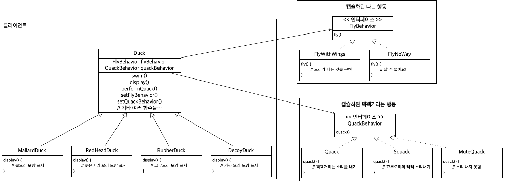

## 1. Interface

처음 Java를 공부할 때 Interface의 역할을 "특정 구현을 강제하는 역할"로 공부했던 것 같다.

그래서 Interface를 통해 다형성을 활용할 수 있는 방법을 잘 떠올리지 못했었다. Head First Design Pattern 책이나, 강의의 예제를 보면서 인터페이스를 사용하는 방법을 다시금 배울 수 있었다.

*Head First Design Pattern Chapter 1 에서 주어진 예시 클래스 다이어그램*

또, 책에서는 되도록이면 Inheritance 보다는 composition을 활용하는 것이 시스템의 유연성이 향상되는 등 장점이 많아서 좋다고 한다. 위 다이어그램대로 생각 해 보면, 확실히 나는 행동이나 소리를 내는 행동을 수정해야 할 때 고쳐야 되는 코드가 굉장히 제한되는 것 같다. 이를 강의에서 결합도를 낮춘다고 표현한다고 하였다.

그 외에도 여러개의 interface를 구현한 클래스에 대해서 interface type의 참조변수를 활용해 이를 메서드의 stencil 처럼 사용하는 방법 등에 대해서 알 수 있었다.

## 2. Lambda Expressions

프론트 쪽 코드를 처음 접했을 때 처음 보는 표현방식에 굉장히 당황했던 기억이 있다.

람다 표현식에 대해 다시 배우다 보니 그동안 List 타입을 array 타입으로 바꾸는 과정에서 IntelliJ 자동완성이 만들어준 코드 중간에 나오던 i -> i 라는 표현에 대해서 갖고 있던 의문이 풀린 것 같다.

나중에 해당 코드를 타고 들어가서 확인해 보려고 한다.

## 3. Method Reference

코드를 작성하고 나면 IntelliJ 에서 종종 노란 줄로 뜨는 부분이 있어서 추천 해 주는 대로 자동수정을 종종 사용하면서 볼 수 있었던 표현이었다.

사실 그동안에는 IntelliJ가 추천해준 거니까, 문제없이 돌아가니까 별로 의식하지 않고 그대로 내버려 두고 사용했던 표현방식이다.
이 표현 방식이 들어온 "파라미터의 값에 변화가 없을 것임을 보장(=입력 값을 변경하지 말라는 의미로도 사용)"한다는 의미도 가지고 있다는 점을 처음 알았다. 값의 변화가 없다는 것을, 혹은 없어야만 한다는 것을 표시하는 것은 꽤나 중요하다고 생각하는데 앞으로 잘 기억 해 두고 사용해 보려고 한다.

또, 내가 몰랐던 생소한 표현을 사용할 때에는 어떤 의미인지, 어떤 장점이 있는지 사용하면서 한번쯤 고민하고 찾아봤어야 했다는 생각이 든다.. 앞으로 내가 모르는 표현방식이 나오면 한번씩 꼭 찾아보는 습관을 가져야 겠다.
